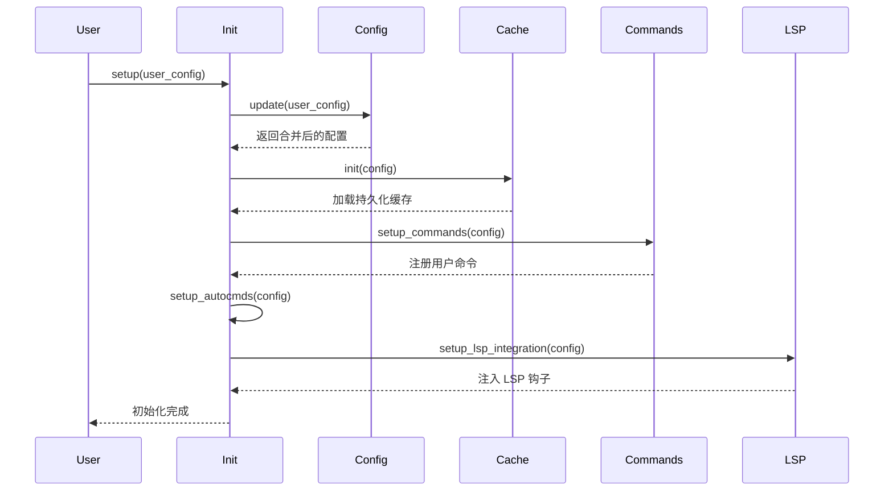
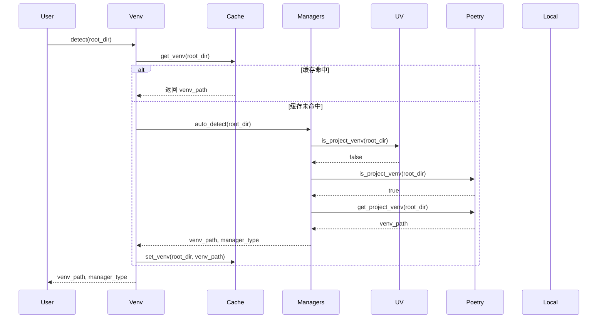
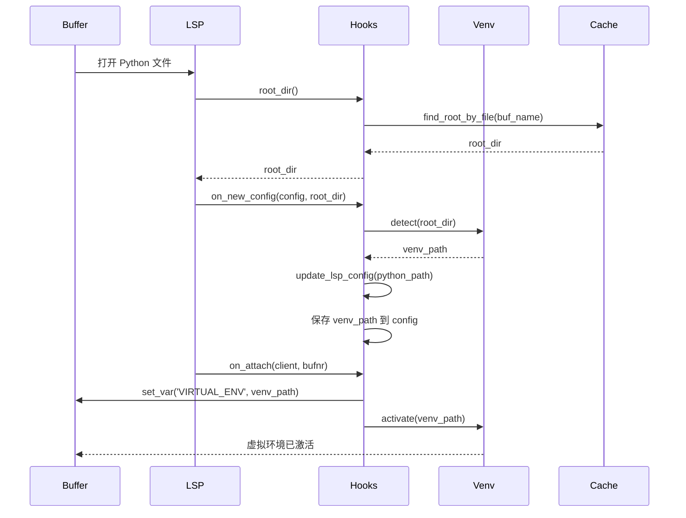

# nvim-python-venv 架构文档

## 📁 项目结构

```
nvim-python-venv/
├── lua/nvim-python-venv/
│   ├── init.lua              # 主入口，setup 函数
│   ├── config.lua            # 配置管理
│   ├── venv.lua              # 虚拟环境核心（检测、激活、停用）
│   ├── cache.lua             # 三层缓存系统
│   ├── lsp.lua               # LSP 深度集成
│   ├── commands.lua          # 用户命令系统
│   │
│   ├── common/               # 通用工具模块
│   │   ├── path.lua          # 路径处理
│   │   ├── os.lua            # 操作系统相关
│   │   ├── shell.lua         # Shell 命令执行
│   │   └── logger.lua        # 日志系统
│   │
│   └── managers/             # 虚拟环境管理器
│       ├── init.lua          # 管理器统一入口
│       ├── base.lua          # 管理器基类接口
│       ├── uv.lua            # UV 管理器
│       ├── poetry.lua        # Poetry 管理器
│       ├── pipenv.lua        # Pipenv 管理器
│       ├── conda.lua         # Conda 管理器
│       ├── pyenv.lua         # Pyenv 管理器
│       ├── local_venv.lua    # 本地 venv 管理器
│       └── virtualenvwrapper.lua  # Virtualenvwrapper 管理器
│
├── test/
│   └── basic_spec.lua        # 基础测试
│
├── examples/
│   └── config.lua            # 配置示例
│
├── doc/                      # 文档目录（预留）
├── README.md                 # 用户文档
├── ARCHITECTURE.md           # 本文档
└── package.json              # 插件元数据

总计：21 个 Lua 文件
```

## 🏗️ 架构设计

### 分层架构

```
┌─────────────────────────────────────────────────────────┐
│                    用户接口层                             │
│  ┌──────────┬──────────┬──────────┬──────────┐          │
│  │ 命令系统  │  Lua API │ 自动命令  │  快捷键  │          │
│  └──────────┴──────────┴──────────┴──────────┘          │
└─────────────────────────────────────────────────────────┘
                          ▼
┌─────────────────────────────────────────────────────────┐
│                    核心业务层                             │
│  ┌───────────┬───────────┬───────────┬──────────┐       │
│  │ Setup     │ Config    │ Venv Core │ LSP Core │       │
│  │ 初始化     │ 配置管理   │ 环境管理   │ LSP集成  │       │
│  └───────────┴───────────┴───────────┴──────────┘       │
└─────────────────────────────────────────────────────────┘
                          ▼
┌─────────────────────────────────────────────────────────┐
│                  虚拟环境管理层                           │
│  ┌────┬────────┬────────┬────────┬────────┬──────┐     │
│  │ UV │ Poetry │ Pipenv │ Conda  │ Pyenv  │ ...  │     │
│  └────┴────────┴────────┴────────┴────────┴──────┘     │
└─────────────────────────────────────────────────────────┘
                          ▼
┌─────────────────────────────────────────────────────────┐
│                    基础设施层                             │
│  ┌───────────┬──────────┬──────────┬──────────┐        │
│  │ Path      │ OS       │ Shell    │ Logger   │        │
│  │ 路径工具   │ 系统工具  │ 命令执行  │ 日志     │        │
│  └───────────┴──────────┴──────────┴──────────┘        │
└─────────────────────────────────────────────────────────┘
                          ▼
┌─────────────────────────────────────────────────────────┐
│                    存储层                                 │
│  ┌────────────────┬───────────────────────┐             │
│  │  内存缓存 (L1)  │  文件缓存 (L2)         │             │
│  │  root -> venv  │  JSON 持久化           │             │
│  └────────────────┴───────────────────────┘             │
└─────────────────────────────────────────────────────────┘
```

## 🔄 核心工作流程

### 1. 插件初始化流程



### 2. 虚拟环境检测流程



### 3. LSP 集成流程



## 🔌 模块详细设计

### init.lua - 主入口

**职责：**
- 插件初始化和配置
- LSP 钩子注入
- 自动命令设置
- 对外 API 导出

**关键函数：**
- `setup(user_config)`: 初始化插件
- `get_active_venv()`: 获取当前虚拟环境（状态栏用）
- `get_venv_status()`: 获取完整状态信息

### config.lua - 配置管理

**职责：**
- 配置存储和验证
- 配置合并和更新
- 默认配置定义

**数据结构：**
```lua
{
  auto_detect = boolean,
  auto_activate = boolean,
  auto_restart_lsp = boolean,
  cache = { enabled, file_path, expire_time, auto_clean },
  managers = { priority[], enabled{} },
  lsp = { servers[], restart_on_venv_change, timeout },
  ui = { selector, notify, notify_level, statusline },
  hooks = { on_venv_activate, on_venv_deactivate, on_lsp_attach }
}
```

### venv.lua - 虚拟环境核心

**职责：**
- 虚拟环境检测
- 虚拟环境激活/停用
- Per-buffer 虚拟环境管理
- 项目根目录查找

**关键函数：**
- `detect(root_dir, config)`: 检测虚拟环境
- `activate(venv_path, config)`: 激活虚拟环境
- `deactivate(config)`: 停用虚拟环境
- `activate_for_buffer(bufnr, config)`: 为 buffer 激活
- `find_root_dir(file_path)`: 查找项目根目录

### cache.lua - 缓存系统

**职责：**
- 三层缓存管理
- JSON 持久化
- 缓存失效和清理

**缓存层级：**
- **L1 内存缓存**: `_memory_cache.root_to_venv`
- **L2 文件缓存**: JSON 文件（异步写入）
- **L3 全局缓存**: `_memory_cache.global_venvs`

**关键函数：**
- `get_venv(root_dir)`: 获取虚拟环境
- `set_venv(root_dir, venv_path, metadata)`: 保存虚拟环境
- `find_root_by_file(file_name)`: 根据文件查找 root
- `clean_invalid_entries()`: 清理无效缓存

### lsp.lua - LSP 集成

**职责：**
- LSP 钩子生成
- LSP 配置更新
- LSP 重启管理

**支持的 LSP 服务器：**
- Pyright: `settings.python.pythonPath`
- Basedpyright: `settings.python.pythonPath`
- Pylsp: `settings.pylsp.plugins.jedi.environment`
- Jedi Language Server: `init_options.workspace.environmentPath`

**关键函数：**
- `make_root_dir_hook(config)`: 生成 root_dir 钩子
- `make_on_new_config_hook(config)`: 生成 on_new_config 钩子
- `make_on_attach_hook(config)`: 生成 on_attach 钩子
- `restart_buffer_lsp(bufnr)`: 重启 buffer 的 LSP
- `restart_root_lsp(root_dir)`: 重启 root 下所有 LSP

### commands.lua - 用户命令

**职责：**
- 用户命令实现
- 交互式虚拟环境选择
- 虚拟环境映射管理

**用户命令：**
- `VenvSelect`: 选择虚拟环境
- `VenvActivate <path>`: 激活虚拟环境
- `VenvDeactivate`: 停用虚拟环境
- `VenvAdd`: 添加映射
- `VenvRemove`: 移除映射
- `VenvRefresh`: 刷新列表
- `VenvInfo`: 显示信息
- `VenvCacheOpen`: 打开缓存文件
- `VenvCacheClear`: 清空缓存
- `VenvLspRestart`: 重启 LSP

### managers/\*.lua - 虚拟环境管理器

**统一接口（base.lua）：**
```lua
{
  name = string,
  priority = number,
  is_available() -> boolean,
  is_project_venv(root_dir) -> boolean,
  get_project_venv(root_dir) -> string|nil,
  get_global_venvs() -> string[],
  get_metadata(venv_path) -> VenvMetadata|nil
}
```

**各管理器特性：**

| 管理器 | 优先级 | 检测标志 | 全局环境 |
|-------|-------|---------|---------|
| UV | 1 | `uv.lock` + `.venv/` | ❌ |
| Poetry | 2 | `poetry.lock` 或 `pyproject.toml` | ✅ |
| Pipenv | 3 | `Pipfile` 或 `Pipfile.lock` | ❌ |
| Conda | 4 | `environment.yml` | ✅ |
| Pyenv | 5 | `.python-version` | ✅ |
| Local Venv | 6 | `.venv/`, `venv/` 等 | ❌ |
| Virtualenvwrapper | 7 | `$WORKON_HOME/<name>` | ✅ |

## 🎯 设计模式

### 1. 策略模式（虚拟环境管理器）

每个管理器实现统一接口，可自由扩展新的管理器。

### 2. 钩子模式（LSP 集成）

通过注入钩子函数实现 LSP 深度集成，不修改 LSP 核心代码。

### 3. 缓存装饰器模式

`with_memory_cache()` 函数实现缓存装饰器，透明缓存函数结果。

### 4. 观察者模式（自动命令）

通过 Neovim autocmd 系统实现事件驱动。

## 🔒 安全性考虑

1. **路径规范化**：所有路径通过 `path.normalize()` 处理
2. **路径验证**：激活前验证虚拟环境和 Python 可执行文件存在
3. **错误处理**：所有外部命令执行都有错误处理
4. **异步安全**：文件写入使用异步 API，避免阻塞

## ⚡ 性能优化

1. **延迟加载**：管理器模块按需加载
2. **三层缓存**：减少重复检测和 shell 命令执行
3. **防抖写入**：500ms 防抖，避免频繁写入文件
4. **异步操作**：文件 I/O 使用异步 API
5. **智能缓存失效**：仅在必要时清除缓存

## 🧪 测试策略

### 单元测试

- 路径工具函数测试
- 缓存系统测试
- 各管理器检测逻辑测试

### 集成测试

- 完整检测流程测试
- LSP 集成测试
- 命令系统测试

### 手动测试场景

- [ ] UV 项目检测
- [ ] Poetry 项目检测
- [ ] Monorepo 场景
- [ ] 虚拟环境切换
- [ ] LSP 重启
- [ ] 缓存持久化

## 🚀 未来扩展

### 已规划

- [ ] 文件监视系统（自动刷新）
- [ ] Telescope/fzf 选择器集成
- [ ] 性能基准测试
- [ ] Vim 帮助文档

### 可能扩展

- [ ] 虚拟环境创建功能
- [ ] 依赖分析和可视化
- [ ] 多 Python 版本管理
- [ ] Docker 容器环境支持

## 📊 代码统计

- **总文件数**: 23 个
- **Lua 代码**: 21 个文件
- **代码行数**: 约 3000+ 行
- **核心模块**: 6 个
- **管理器**: 7 个
- **工具模块**: 4 个

## 🤝 贡献指南

### 添加新的虚拟环境管理器

1. 在 `lua/nvim-python-venv/managers/` 创建新文件
2. 实现 `base.lua` 定义的接口
3. 在 `managers/init.lua` 中注册
4. 在 `config.lua` 中添加配置选项
5. 编写测试
6. 更新文档

### 代码风格

- 使用 LuaLS 类型注解
- 函数文档注释
- 错误处理完整
- 遵循现有代码风格
