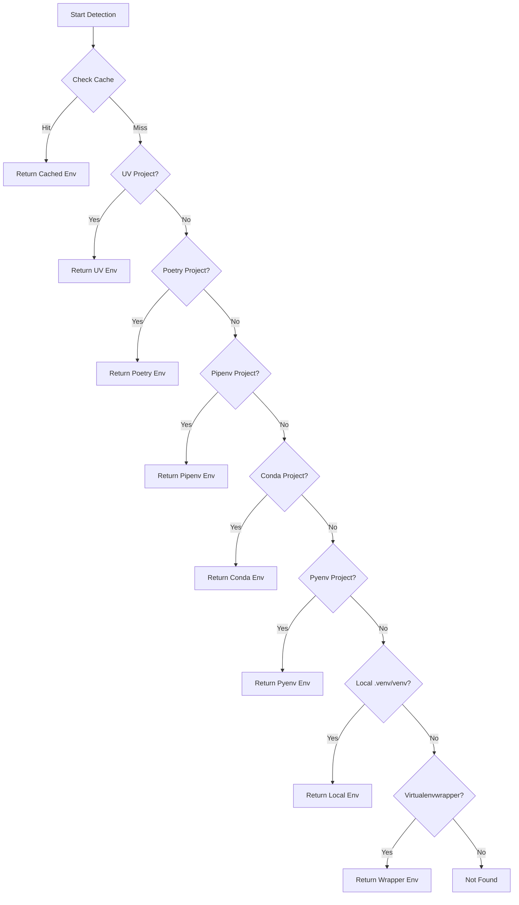

# nvim-python-venv

🐍 Enhanced Neovim Python Virtual Environment Manager

A full-featured Neovim Python virtual environment management plugin with support for multiple virtual environment managers and deep LSP integration.

[中文文档](./README_ZH.md)

## ✨ Features

### 🚀 Core Features

- **Zero Configuration**: Works out of the box with automatic environment detection and activation
- **Multi-Manager Support**: Supports UV, Poetry, Pipenv, Conda, Pyenv, local venv, virtualenvwrapper
- **Smart Detection**: Automatically detects project's virtual environment manager by priority
- **Deep LSP Integration**: Seamless integration with Pyright, Basedpyright, Pylsp, Jedi Language Server
- **Per-Buffer Isolation**: Different buffers can use different virtual environments, perfect for monorepos
- **Persistent Cache**: Maintains virtual environment configuration across sessions for fast startup
- **Rich Command System**: Complete user commands for managing virtual environments
- **Statusline Integration**: Provides API for statusline plugins like lualine to display current virtual environment

### 🎯 Design Principles

- **Zero Configuration First**: Fully automatic by default, no configuration required
- **Progressive Enhancement**: Supports manual management and advanced configuration for complex needs
- **Performance First**: Asynchronous detection, multi-layer caching, minimal startup impact
- **Extensibility**: Plugin architecture makes it easy to add new managers and LSP servers

## 📦 Installation

### lazy.nvim

```lua
{
  'nvim-python-venv',
  ft = 'python',
  config = function()
    require('nvim-python-venv').setup()
  end,
}
```

### packer.nvim

```lua
use {
  'nvim-python-venv',
  ft = 'python',
  config = function()
    require('nvim-python-venv').setup()
  end,
}
```

## ⚙️ Configuration

### Default Configuration (Zero Configuration)

The plugin provides complete default configuration and can be used without any configuration:

```lua
require('nvim-python-venv').setup()
```

### Custom Configuration

```lua
require('nvim-python-venv').setup({
  -- Auto detect virtual environment
  auto_detect = true,
  
  -- Auto activate virtual environment
  auto_activate = true,
  
  -- Auto restart LSP when virtual environment changes
  auto_restart_lsp = true,

  -- Cache configuration
  cache = {
    enabled = true,
    file_path = vim.fn.stdpath('cache') .. '/nvim-python-venv/cache.json',
    expire_time = 0, -- 0 = never expire
    auto_clean = true, -- Auto clean invalid cache
  },

  -- Virtual environment manager configuration
  managers = {
    -- Priority (lower number = higher priority)
    priority = {
      'uv',
      'poetry',
      'pipenv',
      'conda',
      'pyenv',
      'local_venv',
      'virtualenvwrapper',
    },
    -- Enabled managers
    enabled = {
      uv = true,
      poetry = true,
      pipenv = true,
      conda = true,
      pyenv = true,
      local_venv = true,
      virtualenvwrapper = true,
    },
  },

  -- LSP configuration
  lsp = {
    servers = { 'pyright', 'basedpyright', 'pylsp', 'jedi_language_server' },
    restart_on_venv_change = true,
    timeout = 5000,
  },

  -- UI configuration
  ui = {
    selector = 'auto', -- 'auto' | 'telescope' | 'fzf-lua' | 'fzf-vim' | 'nui' | 'vim-ui'
    notify = true,
    notify_level = 'info', -- 'info' | 'warn' | 'error'
    statusline = true,
  },

  -- Hook functions
  hooks = {
    on_venv_activate = function(venv_path)
      -- Execute when virtual environment is activated
    end,
    on_venv_deactivate = function()
      -- Execute when virtual environment is deactivated
    end,
    on_lsp_attach = function(client, bufnr)
      -- Execute when LSP is attached
    end,
  },
})
```

## 🎮 Usage

### User Commands

| Command | Function |
|-----|------|
| `:VenvSelect` | Select and activate virtual environment |
| `:VenvActivate <path>` | Activate virtual environment at specified path |
| `:VenvDeactivate` | Deactivate current virtual environment |
| `:VenvAdd` | Manually add virtual environment mapping |
| `:VenvRemove` | Remove virtual environment mapping |
| `:VenvRefresh` | Refresh virtual environment list |
| `:VenvInfo` | Show current virtual environment information |
| `:VenvCacheOpen` | Open cache file |
| `:VenvCacheClear` | Clear cache |
| `:VenvLspRestart` | Restart Python LSP |

### Lua API

```lua
local venv = require('nvim-python-venv')

-- Get current active virtual environment name (for statusline)
local name = venv.get_active_venv()

-- Get virtual environment status (with complete information)
local status = venv.get_venv_status()
-- {
--   name = "my-project",
--   path = "/path/to/.venv",
--   python_version = "3.11.5",
--   manager = "poetry"
-- }

-- Get virtual environment icon
local icon = venv.get_venv_icon() -- 🐍 📜 🅒 etc.
```

### Statusline Integration Example

#### lualine.nvim

```lua
require('lualine').setup({
  sections = {
    lualine_x = {
      {
        function()
          local venv = require('nvim-python-venv')
          local status = venv.get_venv_status()
          if status then
            return venv.get_venv_icon() .. ' ' .. status.name
          end
          return ''
        end,
        color = { fg = '#98c379' },
      },
    },
  },
})
```

## 🔍 Virtual Environment Detection Logic

The plugin automatically detects virtual environments according to the following priority:



### Manager Detection Markers

| Manager | Detection Markers |
|-------|---------|
| UV | `uv.lock` file + `.venv` directory |
| Poetry | `poetry.lock` or `[tool.poetry]` in `pyproject.toml` |
| Pipenv | `Pipfile` or `Pipfile.lock` |
| Conda | `environment.yml` or `environment.yaml` |
| Pyenv | `.python-version` file |
| Local venv | `.venv`, `venv`, `.env`, `env` directories |
| Virtualenvwrapper | `$WORKON_HOME/<project-name>` directory |

## 🔧 How It Works

### Architecture Design

```
┌─────────────────────────────────────────────────────────┐
│                       User Layer                         │
│  Commands / API / Autocommands / Keybindings             │
└─────────────────────────────────────────────────────────┘
                          │
┌─────────────────────────────────────────────────────────┐
│                       Core Layer                         │
│  Setup Manager / Config / Venv Core / LSP Core           │
└─────────────────────────────────────────────────────────┘
                          │
┌─────────────────────────────────────────────────────────┐
│                Virtual Environment Manager Layer         │
│  UV / Poetry / Pipenv / Conda / Pyenv / Local / Wrapper  │
└─────────────────────────────────────────────────────────┘
                          │
┌─────────────────────────────────────────────────────────┐
│                       Storage Layer                      │
│  Cache System (Memory + File) / State Management         │
└─────────────────────────────────────────────────────────┘
```

### LSP Integration Mechanism

The plugin deeply integrates with LSP through Hook injection:

1. **root_dir Hook**: Prioritizes known project root directories from cache
2. **on_new_config Hook**: Detects and activates virtual environment before LSP initialization
3. **on_attach Hook**: Saves virtual environment path to buffer variable

### Cache System

Three-layer cache architecture ensures performance:

- **L1 Memory Cache**: Current session's root_dir -> venv mapping
- **L2 File Cache**: Persistent JSON cache across sessions
- **L3 Global Environment Cache**: Global virtual environment list for each manager

## 📝 Todo

- [ ] File watch system (auto refresh virtual environments)
- [ ] Telescope/fzf selector integration
- [ ] Unit tests and integration tests
- [ ] Performance optimization and benchmarks
- [ ] Complete Vim documentation

## 🐛 Known Issues

- Windows support not fully tested
- Conda environment parsing may not be robust enough

## 🤝 Contributing

Issues and Pull Requests are welcome!

## 📄 License

MIT License
