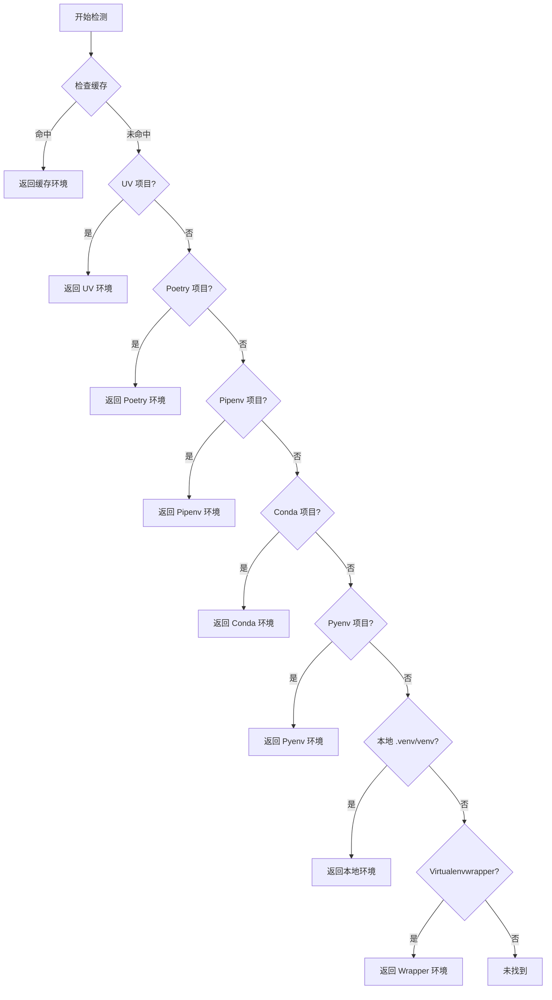

# nvim-python-venv

🐍 增强版 Neovim Python 虚拟环境管理插件

一个功能完善的 Neovim Python 虚拟环境管理插件，支持多种虚拟环境管理器和深度 LSP 集成。

## ✨ 特性

### 🚀 核心功能

- **零配置启动**：开箱即用，自动检测和激活虚拟环境
- **多管理器支持**：支持 UV, Poetry, Pipenv, Conda, Pyenv, 本地 venv, virtualenvwrapper
- **智能检测**：按优先级自动检测项目使用的虚拟环境管理器
- **深度 LSP 集成**：无缝集成 Pyright, Basedpyright, Pylsp, Jedi Language Server
- **Per-buffer 隔离**：不同 buffer 可使用不同虚拟环境，完美支持 monorepo
- **持久化缓存**：会话间保持虚拟环境配置，快速启动
- **丰富命令系统**：提供完整的用户命令来管理虚拟环境
- **状态栏集成**：提供 API 用于 lualine 等状态栏插件显示当前虚拟环境

### 🎯 设计原则

- **零配置优先**：默认全自动，无需配置即可使用
- **渐进式增强**：支持手动管理和高级配置，满足复杂需求
- **性能优先**：异步检测、多层缓存、最小启动影响
- **可扩展性**：插件式架构，易于添加新的管理器和 LSP

## 📦 安装

### lazy.nvim

```lua
{
  'nvim-python-venv',
  ft = 'python',
  config = function()
    require('nvim-python-venv').setup()
  end,
}
```

### packer.nvim

```lua
use {
  'nvim-python-venv',
  ft = 'python',
  config = function()
    require('nvim-python-venv').setup()
  end,
}
```

## ⚙️ 配置

### 默认配置（零配置）

插件提供完整的默认配置，无需任何配置即可使用：

```lua
require('nvim-python-venv').setup()
```

### 自定义配置

```lua
require('nvim-python-venv').setup({
  -- 自动检测虚拟环境
  auto_detect = true,
  
  -- 自动激活虚拟环境
  auto_activate = true,
  
  -- 虚拟环境变更时自动重启 LSP
  auto_restart_lsp = true,

  -- 缓存配置
  cache = {
    enabled = true,
    file_path = vim.fn.stdpath('cache') .. '/nvim-python-venv/cache.json',
    expire_time = 0, -- 0 = 永不过期
    auto_clean = true, -- 自动清理无效缓存
  },

  -- 虚拟环境管理器配置
  managers = {
    -- 优先级（数字越小优先级越高）
    priority = {
      'uv',
      'poetry',
      'pipenv',
      'conda',
      'pyenv',
      'local_venv',
      'virtualenvwrapper',
    },
    -- 启用的管理器
    enabled = {
      uv = true,
      poetry = true,
      pipenv = true,
      conda = true,
      pyenv = true,
      local_venv = true,
      virtualenvwrapper = true,
    },
  },

  -- LSP 配置
  lsp = {
    servers = { 'pyright', 'basedpyright', 'pylsp', 'jedi_language_server' },
    restart_on_venv_change = true,
    timeout = 5000,
  },

  -- UI 配置
  ui = {
    selector = 'auto', -- 'auto' | 'telescope' | 'fzf-lua' | 'fzf-vim' | 'nui' | 'vim-ui'
    notify = true,
    notify_level = 'info', -- 'info' | 'warn' | 'error'
    statusline = true,
  },

  -- 钩子函数
  hooks = {
    on_venv_activate = function(venv_path)
      -- 虚拟环境激活时执行
    end,
    on_venv_deactivate = function()
      -- 虚拟环境停用时执行
    end,
    on_lsp_attach = function(client, bufnr)
      -- LSP 附加时执行
    end,
  },
})
```

## 🎮 使用方法

### 用户命令

| 命令 | 功能 |
|-----|------|
| `:VenvSelect` | 选择并激活虚拟环境 |
| `:VenvActivate <path>` | 激活指定路径的虚拟环境 |
| `:VenvDeactivate` | 停用当前虚拟环境 |
| `:VenvAdd` | 手动添加虚拟环境映射 |
| `:VenvRemove` | 移除虚拟环境映射 |
| `:VenvRefresh` | 刷新虚拟环境列表 |
| `:VenvInfo` | 显示当前虚拟环境信息 |
| `:VenvCacheOpen` | 打开缓存文件 |
| `:VenvCacheClear` | 清空缓存 |
| `:VenvLspRestart` | 重启 Python LSP |

### Lua API

```lua
local venv = require('nvim-python-venv')

-- 获取当前激活的虚拟环境名称（用于状态栏）
local name = venv.get_active_venv()

-- 获取虚拟环境状态（包含完整信息）
local status = venv.get_venv_status()
-- {
--   name = "my-project",
--   path = "/path/to/.venv",
--   python_version = "3.11.5",
--   manager = "poetry"
-- }

-- 获取虚拟环境图标
local icon = venv.get_venv_icon() -- 🐍 📜 🅒 等
```

### 状态栏集成示例

#### lualine.nvim

```lua
require('lualine').setup({
  sections = {
    lualine_x = {
      {
        function()
          local venv = require('nvim-python-venv')
          local status = venv.get_venv_status()
          if status then
            return venv.get_venv_icon() .. ' ' .. status.name
          end
          return ''
        end,
        color = { fg = '#98c379' },
      },
    },
  },
})
```

## 🔍 虚拟环境检测逻辑

插件按以下优先级自动检测虚拟环境：



### 各管理器检测标志

| 管理器 | 检测标志 |
|-------|---------|
| UV | `uv.lock` 文件 + `.venv` 目录 |
| Poetry | `poetry.lock` 或 `pyproject.toml` 中的 `[tool.poetry]` |
| Pipenv | `Pipfile` 或 `Pipfile.lock` |
| Conda | `environment.yml` 或 `environment.yaml` |
| Pyenv | `.python-version` 文件 |
| 本地 venv | `.venv`, `venv`, `.env`, `env` 目录 |
| Virtualenvwrapper | `$WORKON_HOME/<project-name>` 目录 |

## 🔧 工作原理

### 架构设计

```
┌─────────────────────────────────────────────────────────┐
│                       用户层                              │
│  命令 / API / 自动命令 / 快捷键                           │
└─────────────────────────────────────────────────────────┘
                          │
┌─────────────────────────────────────────────────────────┐
│                       核心层                              │
│  Setup 管理器 / 配置管理 / 虚拟环境核心 / LSP 核心        │
└─────────────────────────────────────────────────────────┘
                          │
┌─────────────────────────────────────────────────────────┐
│                   虚拟环境管理器层                        │
│  UV / Poetry / Pipenv / Conda / Pyenv / 本地 / Wrapper   │
└─────────────────────────────────────────────────────────┘
                          │
┌─────────────────────────────────────────────────────────┐
│                       存储层                              │
│  缓存系统（内存 + 文件）/ 状态管理                        │
└─────────────────────────────────────────────────────────┘
```

### LSP 集成机制

插件通过 Hook 注入机制深度集成 LSP：

1. **root_dir Hook**：从缓存优先查找已知的项目根目录
2. **on_new_config Hook**：在 LSP 初始化前检测并激活虚拟环境
3. **on_attach Hook**：将虚拟环境路径保存到 buffer 变量

### 缓存系统

三层缓存架构确保性能：

- **L1 内存缓存**：当前会话的 root_dir -> venv 映射
- **L2 文件缓存**：持久化的 JSON 缓存，会话间保持
- **L3 全局环境缓存**：各管理器的全局虚拟环境列表


## 📝 待办事项

- [ ] 文件监视系统（自动刷新虚拟环境）
- [ ] Telescope/fzf 选择器集成
- [ ] 单元测试和集成测试
- [ ] 性能优化和基准测试
- [ ] 完整的 Vim 文档

## 🐛 已知问题

- Windows 支持未充分测试
- Conda 环境解析可能不够健壮

## 🤝 贡献

欢迎提交 Issue 和 Pull Request！

## 📄 许可证

MIT License


